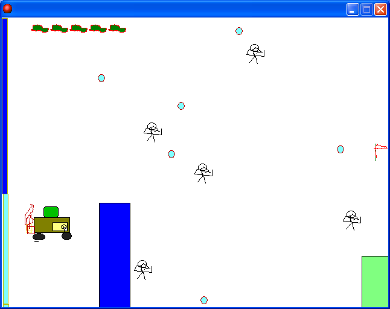

# Convict Drive

A driving game where you steer a car through armed enemies and incoming bullets to reach the clear point. It has a lives system, stages and a boss fight.

  

## How to play

Download from Releases and run it.

Move the car with the arrow keys and hold space to stop. Getting hit by an enemy bullet costs one life, and touching the clear point on the right side of the screen moves you to the next stage. There are four stages with a boss fight along the way.

Remaining lives are shown as icons at the top of the screen. Lose every life and it returns to the title screen.

## How it works

Lives use GameMaker's built in `life` value as is. A lives object placed in every stage room sets `life` to 5 whenever the room is entered, and checks every frame whether any lives are left, sending you back to the title the moment it hits 0. The life icons at the top of the screen come from the built in action that draws a sprite once per remaining life.

## Source vs. release

The project file in `source/` is a revision made after the release build. Score accumulates when you take out enemies or clear a stage, remaining lives and the score appear in the window title bar, and the high score table shows up once every life is lost. The car also breaks when hit by a bullet in this revision. The executable in Releases is the build distributed at the time, kept as it is.

## Files

| Path | Contents |
|---|---|
| `source/convict-drive.gmk` | Original project file |
| `source/split/` | Text tree produced by GmkSplitter |
| `docs/screenshots/` | Screenshots |
| Releases | Distributed build |

## License

CC BY-NC-ND 4.0. Unmodified copies may be shared for noncommercial purposes with attribution. Modified versions and commercial use are not allowed. Bundled libraries, graphics, sounds, and maps made by other people keep their own rights. See [LICENSE](LICENSE).
